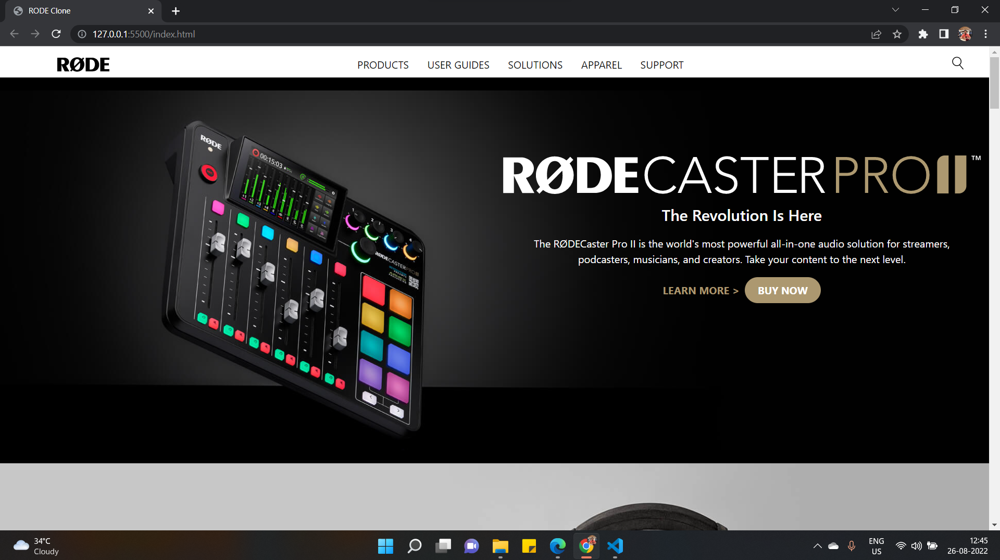
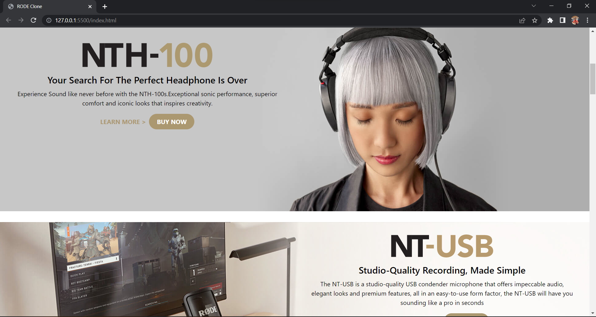
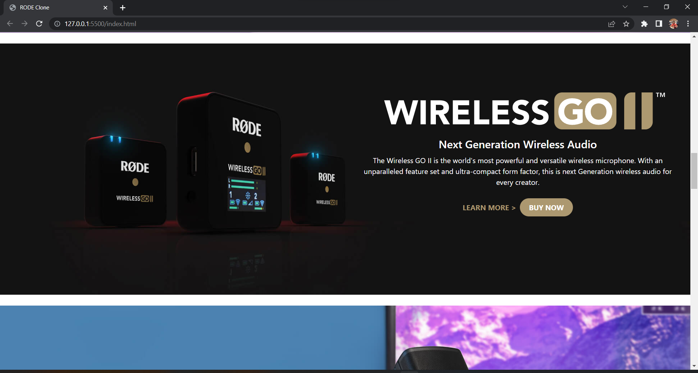
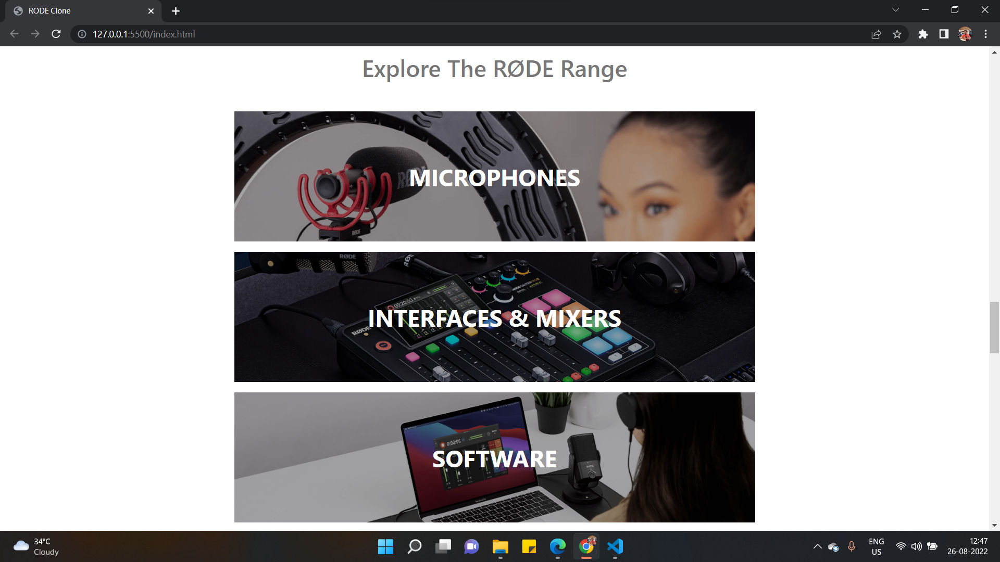
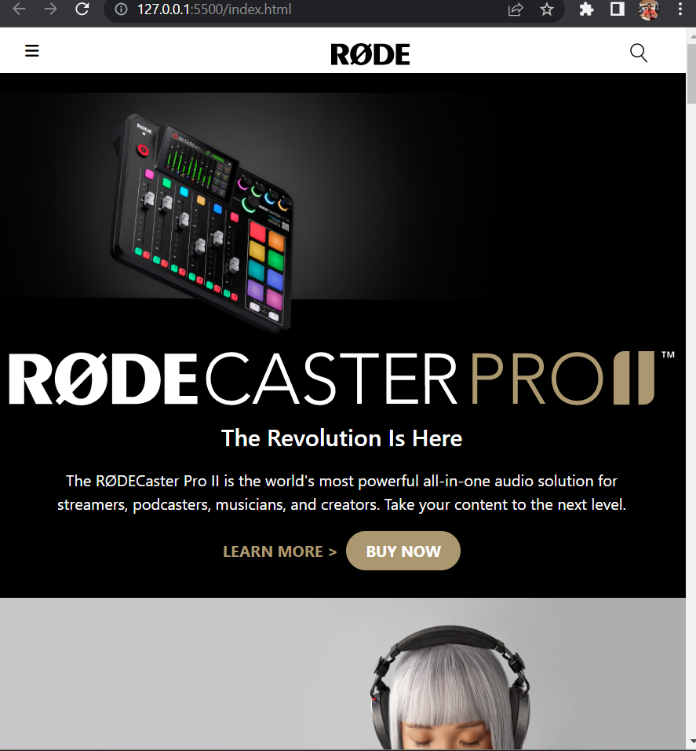
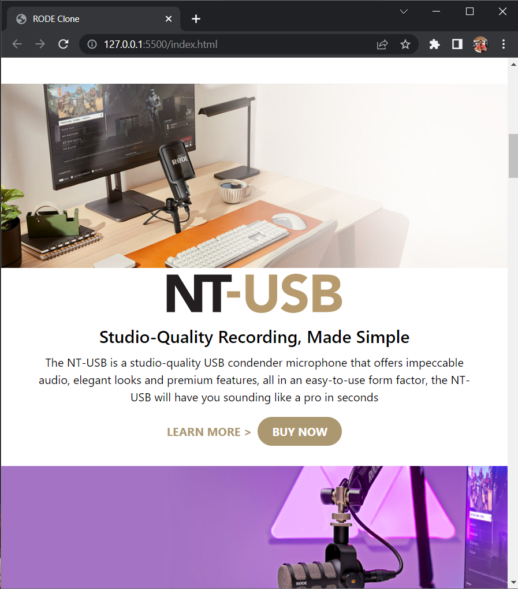
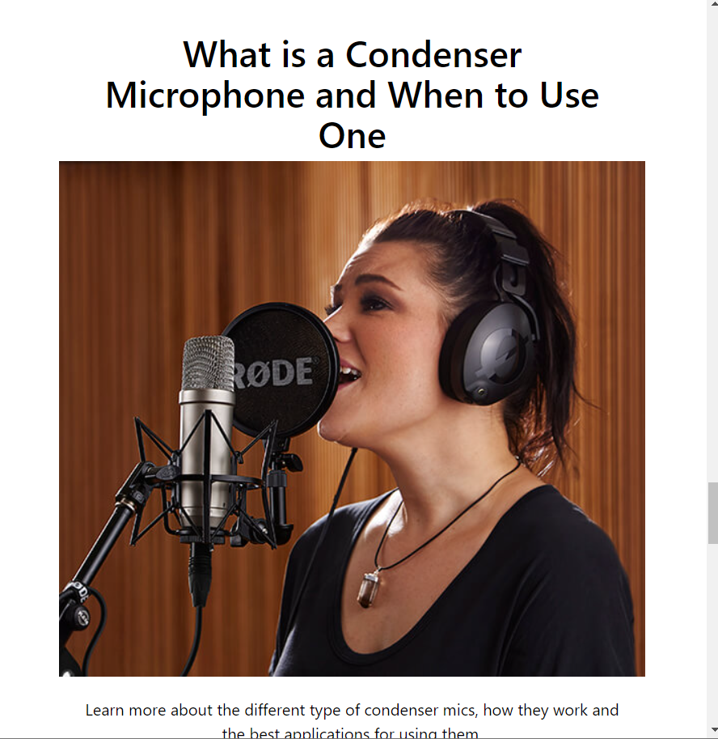

# RODE Homepage Design Clone

I have cloned the [RODE](https://rode.com/en) website using HTML and TAILWIND CSS only.


## Tech Stack:

### `HTML`
### `TAILWIND CSS`

***
### Check the live website [here]()

## My Learnings 
- Learned more classes in Tailwind.
- Created responsive page.
- Learned flexbox concept in Tailwind .
- Used flexbox to make website responsive
- Learned how to place elements on top of images in tailwind.
- Learned ```z-index``` properties

### How the website :






### Responsive 




***

## [Linkedin-Manish](www.linkedin.com/in/manish-kumar-b0639a170)
## [FindCoder-Manish](https://www.findcoder.io/u/itmanishsingh)

